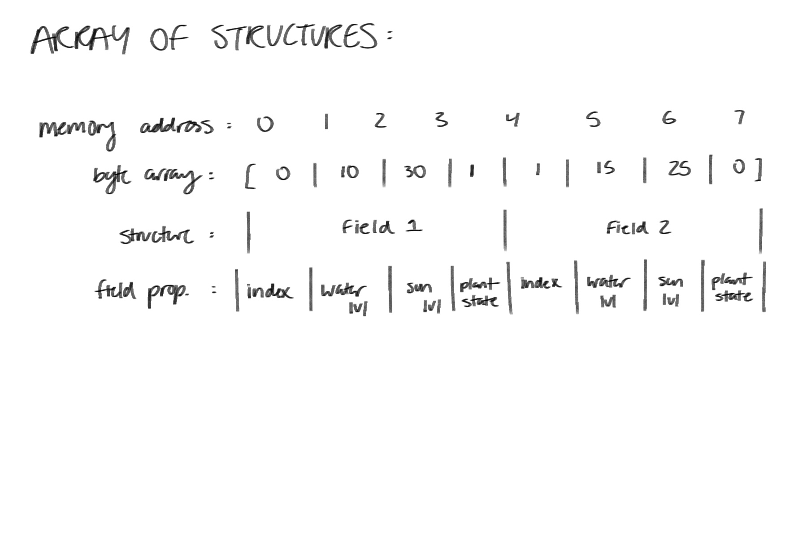

# Devlog Entry - [Nov 13, 2024]
## Introducing the team 

Tools Lead - Dexter Hoang

Engine Lead - Alan Lu

Design Leads - Grace Herman, Yingting Huang

## Tools and Materials
1. For our final project, we intend to use Phaser 3. This is because we have worked with Phaser 3 in CMPM120.

2. The programming languages our team chose was Typescript and JSON. This is because we have a lot of experience using Typescript from this class so we wouldn't have to learn an entirely new langauge. 

3. We plan on using VSCode for writing our code because it is easy for us to collaborate and has tools to easily commit and push changes to our repository. If we have to create visual assets, we will use Pixilart or MagicaVoxel for 2d assets. We chose these tools since most of us have experience using these from a previous class. We are also the most comfortable using a more pixelated style of art for our visual assets. 

4. For our alternate platform, we decided we will still stick with Phaser 3, but our primary lanaguge used will change from Typescript to Javascript. This is because of the many similarities between Typescript and Javascript which will help us greatly when changing our code. 

## Outlook 
Our team hopes to complete this final project in a timely manner without having to rush before the due date. The hardest part of this project would be if we have to make a switch to a different platform/engine. This will not only impact our time, but will require us to transfer our work to an entirely new engine with may differ from our original platform. We are hoping to learn more about our platform and feel more comfortable using it for the future. 

# Devlog Entry - [Dec 3, 2024]

## How we satisfied the software requirements

### [F0.a] The player is able to move over a generated 2D grid using WASD.
### [F0.b] Player can click on a 'Next Day' button to go on to the next day (turn system) to progress through the game.
### [F0.c] When the player is close enough to the grid cell, they are able to click onto asid grid which pops up a menu which allows them to reap (destroy all plants growing there) or sow (plant one of three plants). Clicking the sow button pops up a new menu above the grid which allows them to select the plant they wish so sow. 
### [F0.d] Each grid cell starts off with 0 water and 0 sun. After each day(turn), each cell gets a random amount of water and sun. Sunlight will change from day to day from 0-100 but the water will accumulate over time, gaining a random amount from 0-10 each turn.
### [F0.e] Our three plants, mushrooms, flowers, and herbs, all have 3 distinct stages of growth which the player can visually see as they grow.
### [F0.f] Plants grow based on 2 factors the water accumulated and the sun for that turn. The water and sun need to be passed the threshold in order for the plant to grow which means even if the plant has enough water, it needs a day(turn) when there is enough sun for it to grow. The same applies to plants growing from stage 2 to 3 except the threshold is higher. When the player plants something on a tile, the neighboring tiles are checked to see if there are plants in nearby grids. If they are present, the amount of water needed for growth in increased based on the number of plants nearby.
### [F0.g] When the player successfully grows 10 plants fully (counter at the bottom of the screen), a text will show that says "You Win!".

## Reflection

### After completing this part of the project, we realized that we have to split the workload more evenly with each other. The amount of work was greater than we thought which led us to chrunching on time and staying up late. As a result, we will focus more on our team organization and planning so that everyone does their fair share of work and not a majority of the work gets pushed onto a member(s).

# Devlog Entry - [Dec 5, 2024]

## How we satisfied the software requirements

### [F0.a - F0.g] Same as last week.
### [F1.a] Grid was backed by a single continguous byte array using AoS (Array of Structures) format. The bytes in the array followed the order: index, water level, sun level, and plant state. 
### [F1.b] Game auto-saves every couple of minutes, and everytime the player makes a choice. The player is able to quit out of game, and has the option to resume from their last progress, or start a new game when they come back to the game. 
### [F1.c] There is a save button and a load button. The player has the option to save to three different saving files, and can load from any of the three saving files, including from the last auto-save.
### [F1.d] There's an undo and redo button. The undo button will undo the last move from the player including undoing the status such as the water level and the sun level. The redo button will redo undo moves from the player.

## Reflection

### After completing this part of the project, we realized that meeting the requirements was not feasible using Unity. As a result, we made a quick decision to switch to Phaser with TypeScript. This change in engines allowed us to work on the requirements more effectively. Additionally, we recognized that our approach to dividing tasks could have been better. Instead of assigning specific parts of the project to only a few team members, it would have been more efficient to distribute the workload evenly among everyone. This collaborative approach would have enhanced overall productivity and ensured a more balanced contribution from the entire team.

# Devlog Entry - [Dec 8, 2024]

## How we satisfied the software requirements

### [F0.a - F0.g] No major changes were made.
### [F1.a - F1.d] No major changes were made.
### [F2.a] Our external DSL is based on YAML data language. In our YAML file the player is able to change gameplay scenarios such as starting conditions (grid_cols, grid_rows), victory conditions (third_stage_plants), and even schedule different weather events like storms, droughts, and winter that occur at intervals. The player is given the ability to change the effects or each weather event and whether or not it is active. 
```
weather_randomization:
  Storm:
    isActive: true
    interval: 10 # Applies weather event every (interval) day(s)
    effects:
      sun_decrease: 0.8 # 20% decrease in plant sun levels
      water_increase: 0.6 # 40% increase in plant water levels
```
### In this example scenario, the player is setting the weather event Storm to active meaning that it is able to occur during gameplay. The interval is set to 10 meaning that for every 10 days the weather event Storm will occur. The effects contain sun_decrease and water_increase that are set to percentages. In this example, there is a 20% decrease in each plant's sun level and a 40% increase in each plant's water level. 
### [F2.b] Our internal DSL is using the host language Javascript/Phaser3. 
```
class PlantType {
    constructor(name) {
        this.name = name;
        this.conditions = [];
    }

    requiresWater(operator, value) {
        this.conditions.push({ type: "water", operator, value });
        return this;
    }
...

    canGrow(field, neighbors) {
        return this.conditions.every(condition => {
            switch (condition.type) {
                case "water":
                    return eval(`${field.waterLevel} ${condition.operator} ${condition.value}`);
                case "neighborPlantLevel":
                    return neighbors.some(neighbor => eval(`${neighbor.plantLevel} ${condition.operator} ${condition.value}`));
                case "neighborSunLevel":
                    return neighbors.every(neighbor => eval(`${neighbor.sunLevel} ${condition.operator} ${condition.value}`));
                default:
                    return false;
            }
        });
    }
}

const Sunflower = new PlantType("Sunflower")
    .requiresWater(">", 50)
    .requiresNeighborPlantLevel(">", 0)
    .build();

const plantRegistry = {
    Sunflower: Sunflower,
};

// Checking whether the plant can grow
const field = { waterLevel: 60, sunLevel: 40 };
const neighbors = [
    { plantLevel: 1, sunLevel: 30 },
    { plantLevel: 0, sunLevel: 20 }
];

const sunflowerCanGrow = plantRegistry.Sunflower.canGrow(field, neighbors);
console.log("Can Sunflower grow?", sunflowerCanGrow);

```
### In this code example, the PlantType class allows the player to define the growth conditions for different plant types as shown for Sunflower. In this example, Sunflower needs a water level greater than 50 and at least one neighboring plant with a plant level greater than 0. The function canGrow checks for these conditions and returns when conditions for the plant type are met. Our DSL uses JavaScript's built-in features which makes adding new conditions easy for the player. Javascript also allows our DSL to use features such as eval(), arrays, objects, and dynamic typing which be difficult to replicate in an external DSL.
### [F2.c] We switched from Phaser Typescript to Phaser Javascript. We did this because it supports a wide range of libraries and frameworks, along with simpler syntax. This allowed us to fix the issues that we couldn't fix originally before the switch, such as our undo/redo button. Overall, our game flows better due to this switch. The switch was done by carrying over the existing Typescript logic and structure, while changing up some formats that Javascript doesn't carry. The Phaser 3 API was carried over as well as it supports both languages. We did not run into any issues trying to run it, as we have experience in Javascript. 

## Reflection
### We definitely had less time to do this part because we switched from Unity to Typescript previously, but because we have more experience in these two languages it definitely made up for the lost time. The switch itself was smooth because Phaser supports both languages, so there were no drastic issues there. 

# Devlog Entry - [Dec 8, 2024]

## How we satisfied the software requirements

### [F0.a - F0.g] No major changes were made.
### [F1.a - F1.d] No major changes were made.
### [F2.a-F2.d] No major changes were made.
### [F3.a Internationalization] The game uses a localization function to translate the texts and messages between different languages, making it switchable to different languages including english. The player is able to switch different languages using the scroll buttotn by the canvas. It's able to support a logographic script and a right to left script for languages that need those scripts such as chinese and arabic. When adding more languages, all you should need to do is add another file into the locales file, and make it look similar to the english file. You shouldn't need to change anyhting else. I used a lot of debugging to determine if the game is being translated. The code below shows which json file is being used and what that file constains. 
            console.log("language: " + `assets/locales/${languageCode}.json`);
            const response = await fetch(`assets/locales/${languageCode}.json`);
            if (!response.ok) {
                throw new Error(`Could not load ${languageCode}.json`);
            }
            this.languageData = await response.json();
            console.log(JSON.stringify(this.languageData, null, 2));  // Log the loaded data
            
### [F3.b Localization] The player is able to switch different languages with the scroll buttotn by the canvas. They can switch between english, spanish, chinese(logographic) and arabic(right to left). I used chatGPT to help tranlsate the languages in en.json to the other 3 languages. I tried using google translate but with the chinese and arabic, it's hard to determin if the language is consistent with it's own symbols. The game is set up in english origianlly but the player has the option to change it after launching the game, so there's no 4 different versions of the game. 
### [F3.c] If the player is on mobile they are able to add this app to their homescreen and have it function much like a normal app. This was done through the manifest.json file which defines this program as a progressive web app (PWA) and specifying various things like starting url, app icon, and more. I was able to accomplish this portion thanks to the demo that Professor Smith sent in canvas as well as this video here: https://www.youtube.com/watch?v=YSGLw4T8BgQ. 
### [F3.d] The player is able to play this game even while offline if they have it added to their homepage. This is due to serviceworker.js caching the game files during the install event which allows for another event handler, fetch, to load the aforementioned cached assets even when the device is offline. Some changes we made were to play with the phone in landscape as it the player movement and planting would often cause problems with viewing the game when played in portrait mode. 

## Reflection
### We learned that we needed to add more button functions as well as other functions for making the game work on mobile. We had to make a quick change to make buttons from in the game to html buttons. When we worked on getting it to work on mobile and as an app, we realized that it would be better if the buttons were to be on the web browser so that the player doesn't have to deal with the avatar moving to the buttons in the game. 
